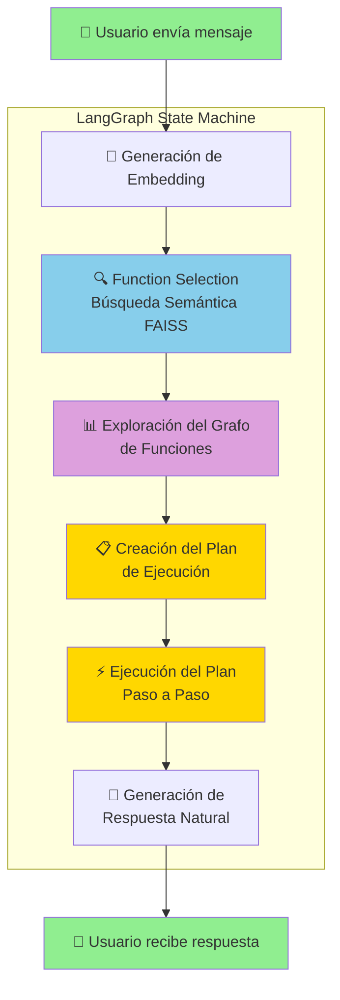
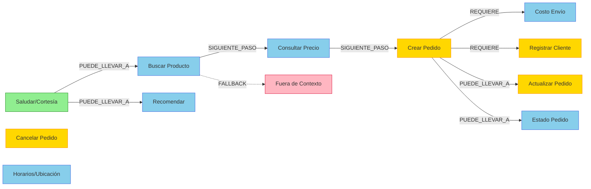

# 🥐 Agente IA Panadería - Sistema de Atención Inteligente

## 📋 Resumen del Proyecto

Sistema de agente conversacional inteligente para una panadería, desarrollado como proyecto de la materia **Análisis Multivariado y Modelos Estocásticos**. El agente utiliza embeddings semánticos y búsqueda por similitud coseno para identificar la intención del usuario y ejecutar la función apropiada.

### Características Principales:
- 🔍 **Function Selection** mediante embeddings y similitud coseno
- 📊 **Grafo de Funciones** que modela las relaciones entre capacidades
- 📝 **Creación de planes** de ejecución multi-paso
- ⚡ **Ejecución y monitoreo** con logs detallados
- 💬 **Respuestas naturales** con datos concretos del inventario

---

## 🛠️ Stack de Tecnologías

| Categoría | Tecnología | Uso |
|-----------|------------|-----|
| **Backend** | FastAPI + Uvicorn | API REST |
| **Base de Datos** | SQLite + SQLAlchemy | Almacenamiento de funciones |
| **Embeddings** | HuggingFace (paraphrase-multilingual-MiniLM-L12-v2) | Vectorización de queries |
| **Vector Store** | FAISS | Búsqueda por similitud |
| **Orquestación** | LangGraph | Máquina de estados del agente |
| **Grafo Funciones** | Neo4j (opcional) / In-Memory | Relaciones entre funciones |
| **LLM** | Groq (llama-3.3-70b) / OpenAI / Ollama | Generación de respuestas |
| **Frontend** | Expo (React Native) | Aplicación móvil |

---

## 🔄 Flujo del Proceso del Agente

### Explicación de cada paso:

1. **Generación de Embedding** (`route_node`): El query del usuario se convierte en un vector de 384 dimensiones usando el modelo `paraphrase-multilingual-MiniLM-L12-v2`.

2. **Function Selection** (`route_node`): Se calcula la similitud coseno entre el embedding del query y los embeddings de todas las funciones disponibles. Se selecciona la función con mayor score.

3. **Exploración del Grafo** (`explore_graph_node`): Se consulta el grafo de funciones para identificar:
   - Funciones relacionadas (PUEDE_LLEVAR_A)
   - Dependencias requeridas (REQUIERE)
   - Posibles siguientes pasos (SIGUIENTE_PASO)

4. **Creación del Plan** (`plan_node`): Se genera un plan de ejecución **dinámico basado en el grafo**:
   - Agrega pasos previos si el grafo lo indica
   - Incluye dependencias obligatorias (REQUIERE)
   - Finaliza con la función principal

5. **Ejecución del Plan** (`exec_node`): Cada paso se ejecuta secuencialmente con logging detallado. Las funciones acceden a datos reales del inventario.

6. **Respuesta Natural** (`respond_node`): El LLM genera una respuesta amigable usando los datos concretos obtenidos (precios, stock, totales).

---

## 📊 Grafo de Funciones

### Tipos de Relaciones:
- **SIGUIENTE_PASO**: Flujo natural de la conversación
- **PUEDE_LLEVAR_A**: Transición opcional según contexto
- **REQUIERE**: Dependencia necesaria para completar la acción
- **FALLBACK**: Manejo de casos fuera del dominio

---

## ✅ Conclusiones

1. **Embeddings Semánticos**: El uso de embeddings multilingües permite capturar la intención del usuario incluso con diferentes formas de expresar la misma solicitud.

2. **Similitud Coseno**: Es una métrica efectiva para comparar vectores de texto, especialmente cuando están normalizados.

3. **LangGraph**: Proporciona una estructura clara para definir el flujo del agente como una máquina de estados, facilitando el debugging y la extensibilidad.

4. **Grafo de Funciones**: Modelar las relaciones entre funciones permite crear planes de ejecución más inteligentes que consideran dependencias.

5. **Respuestas Concretas**: Al integrar datos reales del inventario, el agente proporciona información útil y específica.

---

## 👥 Autores

| Nombre | Rol |
|--------|-----|
| Walther Sebastian Verdugo Cabrera | Desarrollador Principal |
---

## 📞 Información de Contacto

- **Email**: sebastianvccv@gmail.com
- **GitHub**: [@verdugong](https://github.com/verdugong)
---
